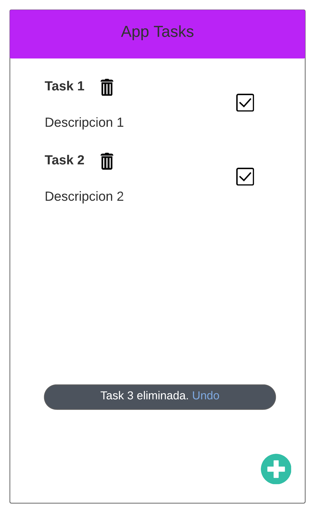
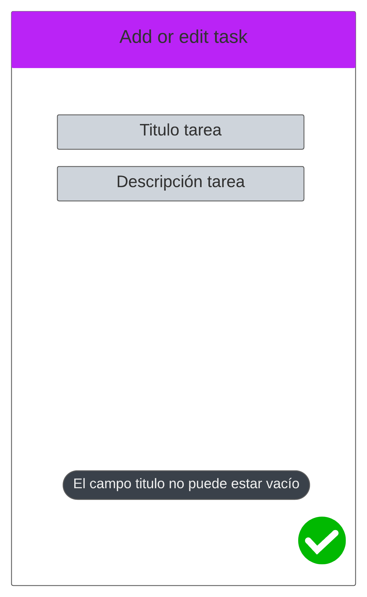
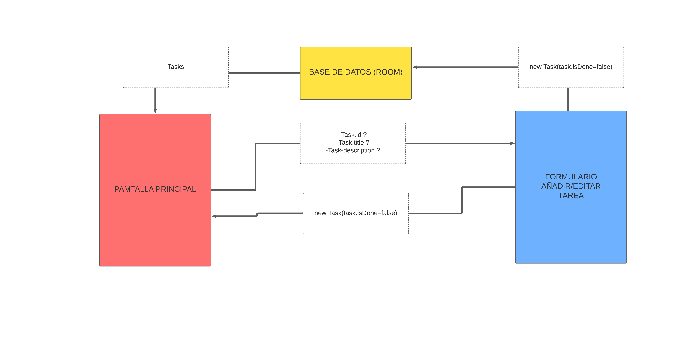

# Diseño 

En la pantalla principal estarán las tareas creadas, en el icono de la papelera que aparece en cada tarea podremos eliminar dicha tarea, con la checkbox podremos marcar si la tarea está realizada o no (esto se verá reflejado en la base de datos también) y si clicamos sobre la tarea o en el icono de la esquina inferior derecha accederemos a la siguiente vista de la aplicación donde podremos editar o crear una nueva tarea en función de lo que hayamos clicado. Cabe destacar que en esta vista si eliminamos una tarea aparecerá un toast informándonos y permitiéndonos recuperar la tarea.

En la segunda vista de la aplicación podremos editar o crear una tarea mediante un formulario de 2 campos de los cuales el título es obligatorio y en caso de no ser cubierto e intentar añadir o actualizar una tarea sin ese campo se nos notificará mediante un toast.

## Navegación 

